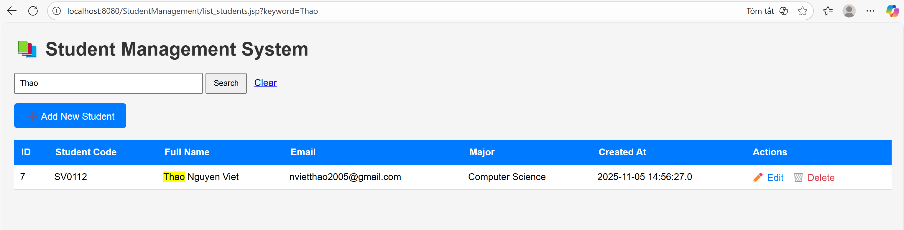
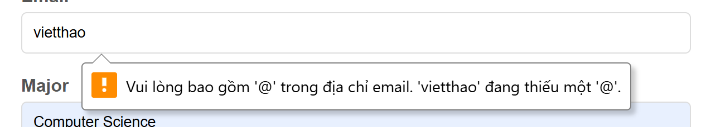
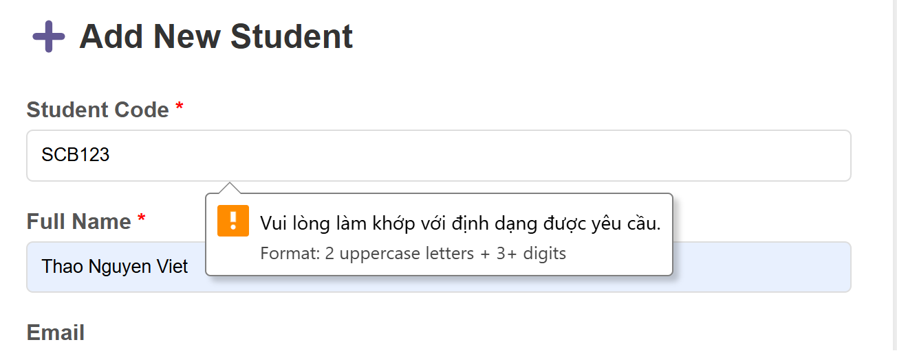
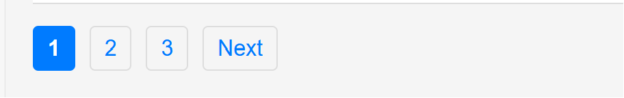

# Web-Application-Development-Lab-04
# NGUYEN VIET THAO - ITCSIU23058

Simple Student Management

## 1) Add Student Workflow

1) User visits `list_students.jsp`.
2) User clicks **Add Student** → Move to `add_student.jsp`.
3) User fills the form and submits → POST request to `process_add.jsp`.
4) `process_add.jsp` inserts new data into database.
5) Redirect back to `list_students.jsp`.
6) Display the updated list.

```
list_students.jsp
    ↓ click Add
add_student.jsp
    ↓ submit
process_add.jsp
    ↓ INSERT DB
list_students.jsp
```

---

## 2) Edit Student Workflow

1) User visit `list_students.jsp`.
2) User clicks **Edit** → Move to `edit_student.jsp`.
3) Page loads student info using `id` and pre-fills form.
4) User updates fields and submits → POST request to `process_edit.jsp`.
5) `process_edit.jsp` updates the DB.
6) Redirect back to `list_students.jsp`.
7) Display the updated list.

```
list_students.jsp
    ↓ click Edit(id)
edit_student.jsp
    ↓ submit
process_edit.jsp
    ↓ UPDATE DB
list_students.jsp
```

---


## 3) Delete Student Workflow

1) User visit `list_students.jsp`.
2) User clicks **Delete** → Move to `delete_student.jsp`.
3) `delete_student.jsp` validates id.
4) Executes DELETE query.
5) Redirect back to `list_students.jsp` with success or error message.
6) Display the updated list.

```
list_students.jsp
    ↓ click Delete(id)
delete_student.jsp
    ↓ DELETE DB
list_students.jsp
```
---


### Exercise 5 — Search functionality

Search results: <br>


### Exercise 6 — Validation enhancement

Validation email: <br>

<br><br>

Validation student code: <br>


### Exercise 7 — UX improvements & Pagination

Pagination: <br>


